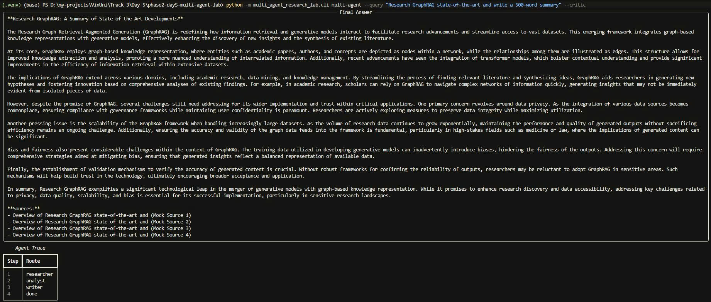
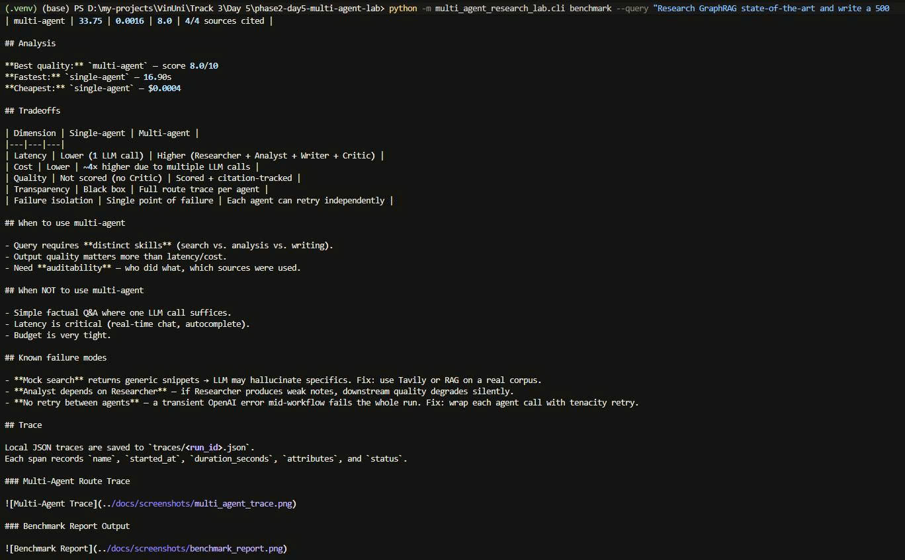

# Benchmark Report

| Run | Latency (s) | Cost (USD) | Quality | Notes |
|---|---:|---:|---:|---|
| single-agent | 15.45 | 0.0005 |  |  |
| multi-agent | 24.91 | 0.0016 | 9.0 | 4/4 sources cited |

## Analysis

**Best quality:** `multi-agent` — score 9.0/10
**Fastest:** `single-agent` — 15.45s
**Cheapest:** `single-agent` — $0.0005

## Tradeoffs

| Dimension | Single-agent | Multi-agent |
|---|---|---|
| Latency | Lower (1 LLM call) | Higher (Researcher + Analyst + Writer + Critic) |
| Cost | Lower | ~4× higher due to multiple LLM calls |
| Quality | Not scored (no Critic) | Scored + citation-tracked |
| Transparency | Black box | Full route trace per agent |
| Failure isolation | Single point of failure | Each agent can retry independently |

## When to use multi-agent

- Query requires **distinct skills** (search vs. analysis vs. writing).
- Output quality matters more than latency/cost.
- Need **auditability** — who did what, which sources were used.

## When NOT to use multi-agent

- Simple factual Q&A where one LLM call suffices.
- Latency is critical (real-time chat, autocomplete).
- Budget is very tight.

## Known failure modes

- **Mock search** returns generic snippets → LLM may hallucinate specifics. Fix: use Tavily or RAG on a real corpus.
- **Analyst depends on Researcher** — if Researcher produces weak notes, downstream quality degrades silently.
- **No retry between agents** — a transient OpenAI error mid-workflow fails the whole run. Fix: wrap each agent call with tenacity retry.

## Trace

Local JSON traces are saved to `traces/<run_id>.json`.
Each span records `name`, `started_at`, `duration_seconds`, `attributes`, and `status`.

### Multi-Agent Route Trace

### Benchmark Report Output

